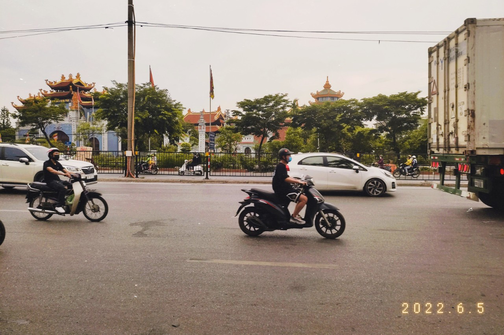

---
# Name of the article
title: "Khi nào chưa phải là kết thúc, thì hãy coi trọng nó như lúc mới bắt đầu."

# Quick description
description: Hà Nội, 9/6/2022.

# Author of the article
author: Hoang Dang Tuan Dat

# Appears as the tail of the output URL.
slug: "the-end-is-the-beginning"

# Date created
date: 2022-06-09T22:22:20+07:00

# Date published. Before that day, the post can not be available
publishDate: 

# Daye expired. After that day, the post can not be available
expiryDate:

# Last modified time of the file
lastmod: 
    - 
    
# Article's tags
tags: 
    - Story
# Article's categories: Chill, Story or Tech
categories: Story 

# Allow share?
socialShare: true

# Useful to link articles together for "See also" part
series: 

# is Math included? Default: false
math: false

# Cover image of the article
image: tree.jpg

# License. Default: CC BY-NC-SA 4.0
license: MIT

---
Ông nội tôi, mất vào lúc tôi mới chào đời được 3 tháng.

Rồi bác tôi.

Nhiều người thân quen với tôi cứ lần lượt đi xa khỏi tôi mãi. Có vẻ như cái giá của việc làm người lớn, chính là phải chứng kiến cảnh một người rời khỏi thế gian.

Bác tôi lúc đó còn phong độ lắm. Mới ngày nào bác ấy còn leo thoăn thoắt lên cây hái những trái dừa đem đi bán, rồi làm những món ăn vặt mà bà bán đầu ngõ hay cổng trường phải chào thua. Tôi quý bác lắm. Mặc dù bác chả phải là ruột thịt gì của tôi.

Nhưng biến cố gia đình xảy ra. Bác suy sụp hoàn toàn và trở thành kẻ nghiện rượu. Cũng phải thôi, cái ngày mà tôi thấy dòng chữ "Mãi yêu em" trên chiếc điện thoại Nokia 1280 của bác cũng là ngày bác nhận ra người vợ kia đã bỏ bác mà đi. 

Cuộc chiến với bệnh tật của bác chỉ kéo dài trong vòng 2 tháng. Quá ngắn với dòng đời một con người. Nhưng đủ cho tôi cảm thấy cái chết, nó thật đáng sợ. Không phải vì tại tôi sợ rằng mình sống không đủ lâu. Tôi sợ việc một ngày nào đó, mình không còn có thể nói lời xin lỗi với những người xung quanh nữa. Tôi càng sợ hơn việc mình chỉ tồn tại dưới dạng một ảo ảnh, một ký ức trong lòng người khác. Và tôi sợ nhất là sự xót thương, sự đau khổ của những người mà tôi yêu quý nhất. 

Chính vì tôi sợ nên tôi chỉ mong muốn rằng mỗi sớm thức dậy tôi lại có thêm một cơ hội để nói lời xin lỗi với mọi người, để làm việc, để học tập, để vui, để nói, và để cười. Cười để hy vọng rằng mình lại có một ngày nữa.  Tôi còn nhiều phương án cho đời mình. Những bài hát chưa được cất lên, những vần thơ chưa được đọc, những nơi xa xôi chưa tới, những người thú vị chưa gặp, những cuốn sách còn chưa chạm tới. 

Đừng tư tưởng, đừng nghĩ suy, chẳng sầu muộn, và càng đừng nên trăn trở thêm về cái chết nữa. Bạn chết vì rơi vào tầm ngắm hay chết như một lựa chọn, điều đó không còn quan trong nữa. Người đời sẽ sớm quên, vì rồi những người nhớ dai nhất rồi cũng nằm xuống với bạn. Lặng im.

Vì khi nào chưa phải là kết thúc, thì hãy coi trọng nó như lúc mới bắt đầu.

