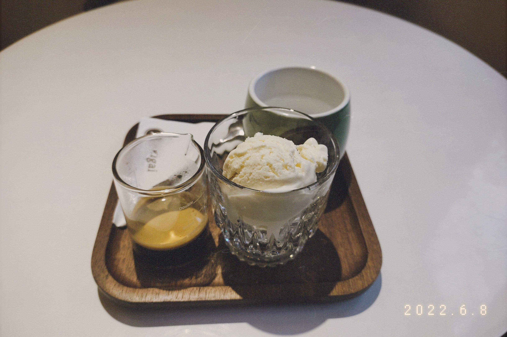

---
# Name of the article
title: "Affogato al caffe - Đắm chìm trong sự đơn giản"

# Quick description
description: Với những người dân Ý, Affogato đôi khi còn cuốn hút họ hơn là Espresso hay Cappucchino...

# Author of the article
author: Hoang Dang Tuan Dat

# Appears as the tail of the output URL.
slug: "Affogato-al-caffe-simple-makes-perfection"

# Date created
date: 2022-05-29T12:44:58+07:00

# Date published. Before that day, the post can not be available
publishDate: 

# Daye expired. After that day, the post can not be available
expiryDate:

# Last modified time of the file
lastmod: 
    - 
    
# Article's tags
tags: 
    - Coffee Stuff
# Article's categories: Chill, Story or Tech
categories: Chill 

# Allow share?
socialShare: true

# Useful to link articles together for "See also" part
series: 

# is Math included? Default: false
math: false

# Cover image of the article
image: affogato.jpg

# License. Default: CC BY-NC-SA 4.0
license: MIT

---

Tươi sáng, đầy màu sắc và khác biệt, Ý là quốc gia Châu Âu có nền văn hóa vô cùng độc đáo và thú vị mà có thể ta chưa khám phá hết. Nước Ý tài hoa là mảnh đất của tình yêu, là cái nôi của nghệ thuật với nhiều lĩnh vực xuất sắc nổi tiếng như hội họa, kiến trúc, âm nhạc hay ẩm thực. Chắc hẳn với nhiều người sẽ không thể quên được kiến trúc khác biệt, một bản giao hưởng du dương giữa cái cổ điển của những tòa nhà Ý còn lưu lại từ thời phục hưng xưa. Toàn thành phố được lấp bởi đá - cung điện, quán xá, những con đường rải sỏi - nóng lên như một cái lò nướng bánh pizza suốt cả ngày, tỏa nhiệt không ngừng kể cả ban đêm.

Không khí của vùng Địa Trung Hải khiến nhiệt độ có thể tăng cao như mùa hè miền Bắc Việt Nam vậy. Một trong những thứ có thể làm dịu nhẹ đi cơn nóng khắc nghiệt ấy sẽ là một cốc Affogato đặc biệt ở một quán cafe bên vỉa hè đầy sỏi đá. 

Affogato, hay còn gọi là Affogato al caffe có nghĩa là “đắm chìm” trong tiếng Ý, là một muỗng gelato chìm trong một tách espresso nóng mới pha. Đó là khi viên kem và cà phê tan vào nhau thành một vũng nước ngọt ngào, buồn vui lẫn lộn, một cách tuyệt vời để kết thúc bữa ăn. Và chắc chắn nó phải là một muỗng gelato, không phải là một muỗng kem thông thường khác. 

# Gelato - Đứa con mang lại sự tươi mát

Gelato (hoặc ices, như granita) đã được sản xuất ở Ý từ thời La Mã cổ đại, nhưng giống như hầu hết các phát minh rực rỡ khác, có thể bắt nguồn từ các nền văn hóa Trung Quốc và Ả Rập - sorbet hoặc sorbetto bắt nguồn từ từ tiếng Ả Rập "scharbat". Những món tráng miệng đông lạnh ban đầu này có thể là cơ bản (Hoàng đế Nero phục vụ những vị khách của mình mật ong và tráng miệng hương trái cây), nhưng món kem gelato mà chúng ta biết ngày nay có lẽ có từ thời Phục hưng.

Gia đình Medici nổi tiếng ở Florence đã tài trợ cho một cuộc thi nhằm tìm kiếm món tráng miệng đông lạnh tuyệt vời nhất. Một người đàn ông tên Ruggeri, một nông dân chăn nuôi gà và nấu ăn trong thời gian rảnh rỗi, đã tham gia cuộc thi. Món tráng miệng đông lạnh ngon tuyệt của Ruggeri gồm nước trái cây ngọt và đá (tương tự như sorbet ngày nay) đã giành được giải thưởng đáng thèm muốn, ngay lập tức đưa Ruggeri trở thành tâm điểm. Tin tức về tài năng của Ruggeri lan truyền nhanh chóng và Caterina de Medici đưa Ruggeri theo cô đến Pháp. Caterina tin chắc rằng chỉ có anh mới có thể sánh ngang với các món tráng miệng hảo hạng của các đầu bếp Pháp - và phải làm món đặc sản của anh trong đám cưới của cô cho vị Vua tương lai của nước Pháp.

Vào cuối những năm 1500, gia đình Medici đã ủy quyền cho nghệ sĩ kiêm kiến trúc sư nổi tiếng Bernardo Buontalenti chuẩn bị một bữa tiệc tuyệt đẹp cho vị vua Tây Ban Nha đến thăm. Sử dụng kỹ năng nấu nướng của mình để trình bày một màn trình diễn công phu và đẹp mắt, Buontalenti đã trình bày với Vua Tây Ban Nha một món tráng miệng đông lạnh có kem mà ngày nay chúng ta gọi là gelato. 

Đã 350 năm trôi qua và việc làm gelato đã trở thành một hoạt động nghệ thuật cao cấp và là một biểu tượng ẩm thực yêu thích của không chỉ người Ý mà của toàn thế giới. Trong danh sách các món tráng miệng đông lạnh, gelato Ý được mọi người coi là cao cấp nhờ kết cấu mềm, mịn và hương vị tươi mát. 

# Affogato - đơn giản nhưng tinh tế

> “Một trong những món ăn hiện đại ngon miệng nhất của Ý”

Affogato có nghĩa là "đắm chìm" trong tiếng Ý, và bạn có thể chìm sâu trong bất kỳ loại gelato nào. Fior di latte và crema phổ biến nhất ở Ý, mặc dù vani và sô cô la cũng rất ngon. Dulce de leche sẽ rất tuyệt vời, với vị sữa caramel của nó, cũng như vị đắng của rượu anh đào. Bí mật chắc chắn phải là cà phê. Cà phê espresso. Rất tươi, một shot. Cà phê ngon. Pha một lớp cà phê Espresso phủ một lớp crema đặc trưng màu cánh gián, đổ lên lớp kem đã được để sẵn trong chiếc cốc thủy tinh. Đấy, bạn tôi ạ, cả cái đất trời nó hòa vào làm một . Múc một thìa kem đi, cái lạnh nó tràn thẳng vào khoang miệng. Rồi làm một ngụm cà phê để xua tan hẳn cái lạnh đó. Sau đó đợi kem tan ra để một cảm giác ấm áp tràn vào như cái ôm của mẹ hiền vậy. Còn gì tuyệt vời hơn nữa??

Nhưng bạn tôi ơi, đừng để cốc Affogato tuyệt vời kia tan đi mất, mà hãy thưởng thức nó thật nhanh, để cho cái khoang miệng bạn từ bất ngờ này chuyển sang bất ngờ khác trên đầu lưỡi. Để đến khi xong câu chuyện kỳ diệu của hương vị kia, một hậu vị nhẹ nhàng sẽ sạc pin cho bạn suốt cả ngày dài. 

> The coffee gives you energy, and the ice cream makes you happy.

